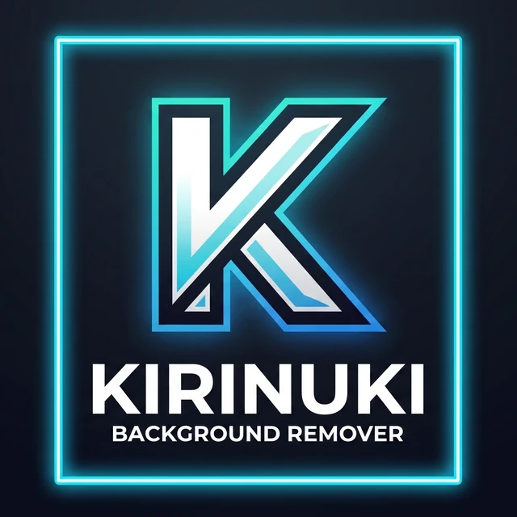
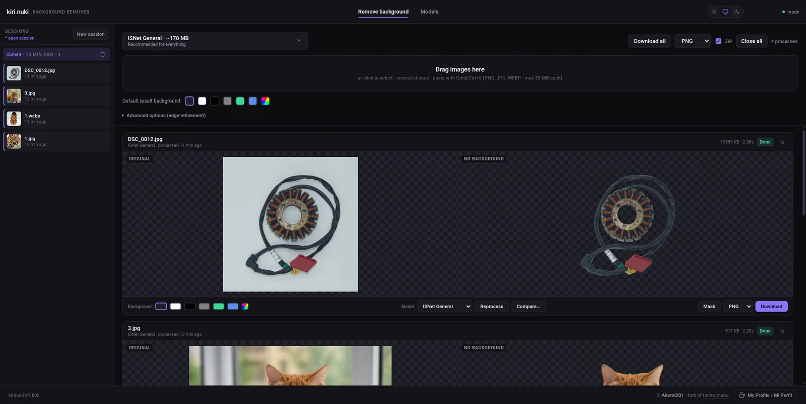
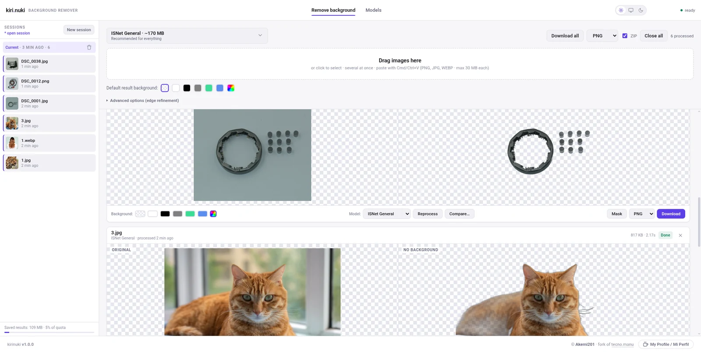
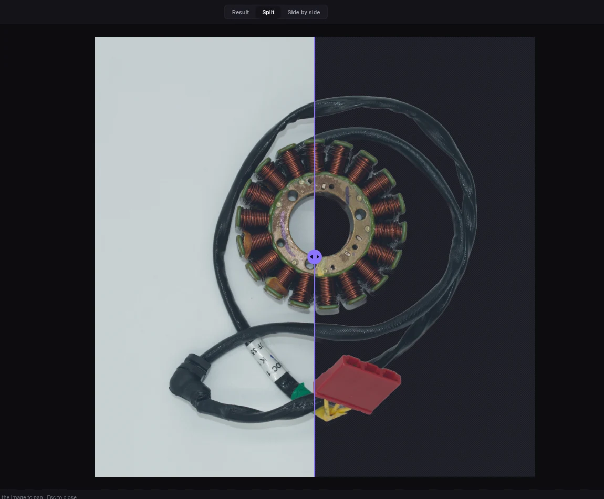
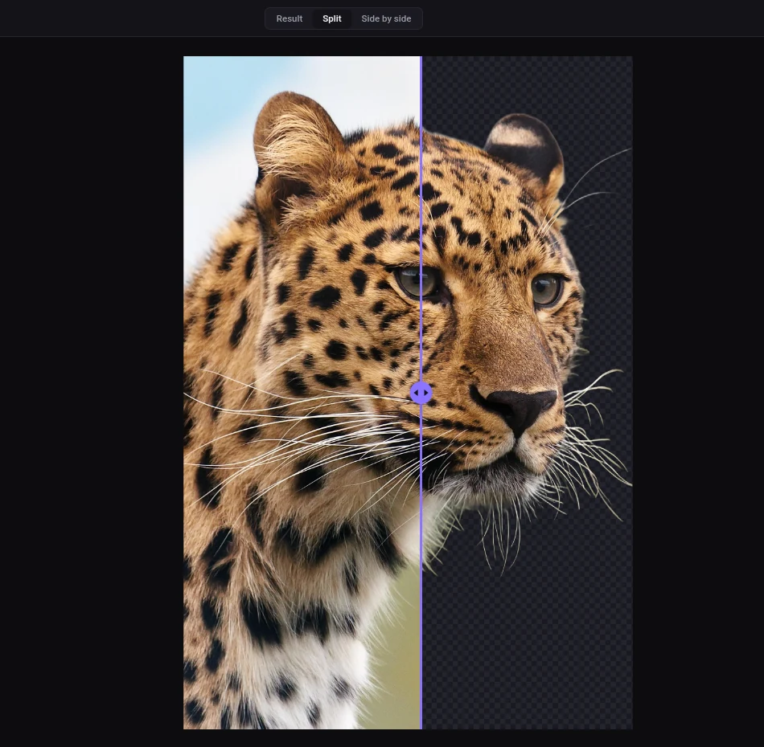
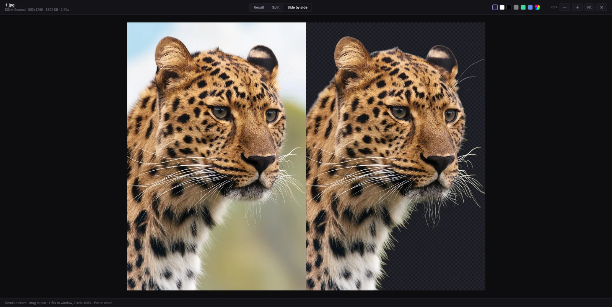
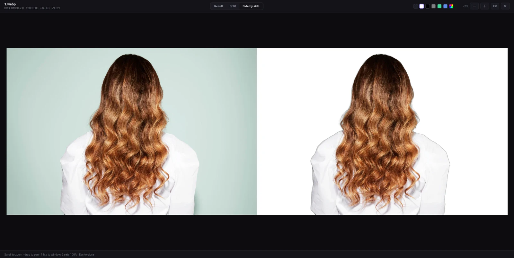
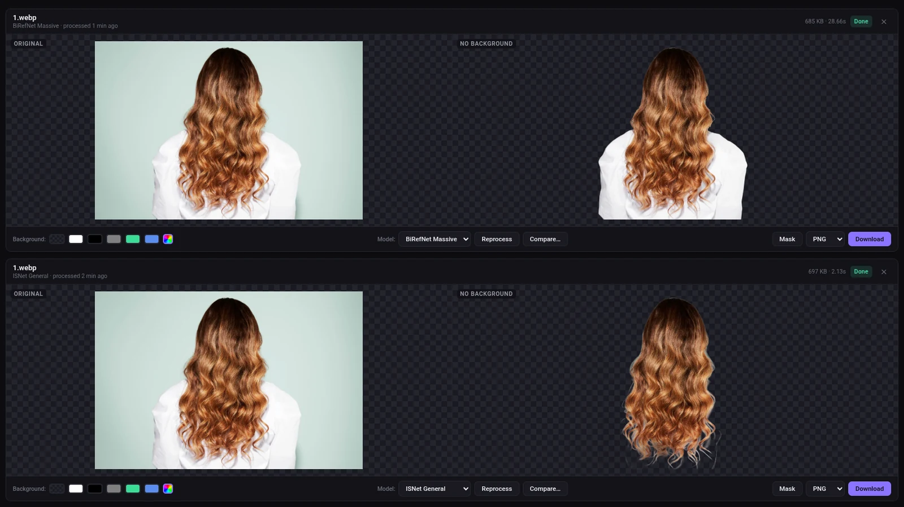
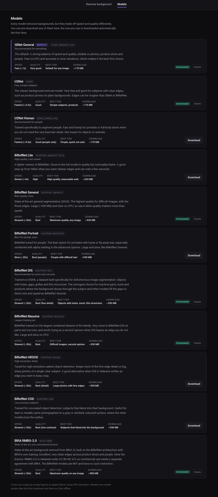

<p align="center">
  
</p>

<p align="center">
  <a href="#install-and-run">Install</a> ·
  <a href="#which-model-to-choose">Models</a> ·
  <a href="#cleaner-edges">Edge refinement</a>
</p>



<details>
<summary>Same thing in the light theme</summary>



</details>

A fast, private background-removal tool that runs entirely on your own machine.

> Unofficial open-source project. Not affiliated with remove.bg or Canva Austria GmbH.
>
> This is a fork of [tecnomanu/remove-background-local](https://github.com/tecnomanu/remove-background-local),
> adapted for **product and spare-part photography**: subjects with holes, mesh
> and thin structures, where general-purpose models tend to fill the gaps in.
> See [what this fork changes](#what-this-fork-changes).

An offline alternative for people who want a workflow similar to cloud
background-removal services such as remove.bg, without uploading images or
paying API costs. Everything runs locally — no limits, no account, no API.

It ships with **ISNet** as the default (fast and high quality) and also includes
the full **BiRefNet** family (2024) — among the best open-source models for
background segmentation, including the DIS variant trained specifically for
objects with holes — plus **BRIA RMBG-2.0**, for when you want maximum quality.

## Features

- Web UI with drag & drop (paste from clipboard works too)
- **Processing queue** — drop several images at once and they are processed one
  by one; each result is kept in its own card, nothing gets overwritten
- **Persistent sessions** — results are saved locally (in the browser) and
  grouped into sessions in the sidebar; they survive reloads until you delete
  them. "New session" starts a fresh batch without losing the old ones
- **Download as PNG, WEBP or JPG**, with the background you choose (transparent
  or a solid color) — per image or all at once
- **Per-result background** to check contrast, independent of the global default
- **First-run setup screen** with a real download progress bar
- **Models page** in the top menu: what each model is best for, which ones are
  downloaded, plus buttons to download or delete each one (with progress)
- **Desktop app** — run it in a native window with `kirinuki desktop` (Electron)
- **`kirinuki` command line** — start/stop, manage models and update from the terminal
- Switch between 12 models depending on the case (general, parts with holes,
  portrait, lite, etc.), including BiRefNet DIS and BRIA RMBG-2.0
- Edge refinement for fine edges (hair, plants, thin structures): ViTMatte,
  halo removal and classic alpha matting
- **Full-size viewer** — open any result to inspect it properly: a
  **before/after slider**, side-by-side, or the cut-out on its own, with zoom
  to 1:1 and a switchable backdrop for spotting halos
- **Compare models** — run the same image through several models at once and
  keep every result, instead of replacing the previous one
- **Trim to content on export** — crops each download to the subject's bounding
  box, with optional padding
- **Download the whole batch as a ZIP**, named per model so a comparison's
  results stay distinguishable
- **Light, dark and system themes** — switch in the header; the choice is remembered
- 100% local processing — your images never leave your machine
- No limits on count or resolution (beyond the file-size cap)

## What this fork changes

The upstream project shipped 6 models and classic alpha matting. This fork is
tuned for photographing parts and products, where the hard part is not the
subject but the gaps in it.

**Five more models (11 total).** The important one is `birefnet-dis`, trained on
DIS5K — a dataset built specifically for objects with holes, grilles and thin
structures. On a bracket or a gear, the general-purpose models fill the gaps
with subject; DIS keeps them open. Also added: `birefnet-massive`,
`birefnet-hrsod`, `birefnet-cod` and `bria-rmbg` (BRIA RMBG-2.0).

**Edge refinement.** `vitmatte` replaces the model's hard mask with a real alpha
channel predicted by a network, which is what fixes the "cut out with scissors"
look. On a test part it produced 2.6x more soft-edge pixels than a plain
cut-out. Alongside it, `decontaminate` removes the halo of background colour
left in the edge, and `post_process_mask` cleans up speckle.

**Two fixes.** Model cache detection was broken against rembg 2.0.80+, which
moved the cache to `~/.rembg/models/<name>/` — every model reported as "not
downloaded" and the delete button freed nothing. And interrupted downloads left
`tmp*` files that nothing collected; these are now reclaimed on delete and at
startup (877 MB on the first real run).

Full details in the [CHANGELOG](CHANGELOG.md).

## Examples

The viewer's **split** mode wipes between the original and the cut-out, which is
how you actually judge an edge rather than guessing at a thumbnail:

| | |
|---|---|
|  |  |
| A stator: coils, cabling and the gaps between them | Whiskers survive against the transparency checkerboard |

**Side by side** puts both halves next to each other, on transparency or on the
backdrop you pick:

| | |
|---|---|
|  |  |
| Transparent backdrop, for spotting leftover background | White backdrop, the usual catalogue output |

## Model comparison

The same photo through two models, kept side by side because **Compare** adds a
result instead of replacing the previous one:



| Model | Loose hair | Time on this image |
|---|---|---|
| ISNet General | Strands are cut off at the outline | 2.13s |
| BiRefNet Massive | Individual strands survive | 28.66s |

That trade is the whole point of having both: ISNet is right for most work, and
the heavy models earn their wait on the difficult ten percent.

## Models

Every model with its size, speed and what it is best at. Download the ones you
need; the rest stay off your disk.



## Requirements

- Any machine with a 64-bit CPU. No GPU needed; the models run on CPU
- **RAM is what decides which models you can run**, not the CPU:
  ~2 GB free for `u2netp`, ~3 GB for the ISNet/U2Net pair, ~4.5 GB for
  BiRefNet Lite and ~8.5 GB for the full BiRefNet models. The server measures
  the free memory and refuses a run that would not fit, so a small machine gets
  a clear message instead of a freeze. See
  [Memory](#memory-which-model-your-machine-can-actually-run)
- Python 3.11 or newer
- Disk space: ~650 MB for the Python environment, plus the models you download
  (170 MB for the default, ~930 MB each for the BiRefNet family). Around 1.5 GB
  covers a normal setup; all twelve models would be ~7.1 GB

Check that you have Python:

```bash
python3 --version
```

If you don't, install it from [python.org](https://www.python.org/downloads/) or with Homebrew: `brew install python`

## Install and run

Needs Python 3.11+ already installed. Node.js is only required for the `kirinuki`
command and the desktop app.

### Option A - npm

```bash
npx -y kirinuki            # run it now, nothing left installed
npm install -g kirinuki    # or install the `kirinuki` command permanently
kirinuki web
```

### Option B - from source

```bash
git clone https://github.com/AkemiKami201/kirinuki-remove-bg
cd kirinuki-remove-bg
./run.sh
```

The first run will:

1. Create a `.venv` virtual environment
2. Install the Python dependencies (can take 2–5 minutes)
3. Start the server

After that, every `./run.sh` starts in a few seconds.

Open in your browser: **http://127.0.0.1:7860**

> The first time you use a model it is downloaded automatically (between 170 and 980 MB depending on the model). After that it stays cached in `~/.rembg/models/<name>/`. Models downloaded by an older version, in the flat `~/.u2net/` folder, are still picked up and are not re-downloaded.

> **Moved the folder?** A Python virtualenv stores absolute paths, so a copied/moved `.venv` is broken. `run.sh` detects this automatically and rebuilds the environment — you don't have to do anything.

## Command line

Running from source, models are managed straight through `server.py`:

```bash
.venv/bin/python server.py models ls                      # list models, mark which are downloaded
.venv/bin/python server.py models pull --model birefnet-dis   # pre-download a model
.venv/bin/python server.py models rm   --model birefnet-dis   # delete a downloaded model
```

Whole folders can be processed without a browser, which is the better route for
a large run: the model loads once, nothing accumulates in the browser's storage,
and a repeated command skips what is already done, so an interrupted batch just
needs running again.

```bash
.venv/bin/python server.py batch ~/photos                      # -> ~/photos/nobg
.venv/bin/python server.py batch ~/photos ~/out --model birefnet-dis
.venv/bin/python server.py batch ~/photos --bgcolor "#ffffff"  # flattened, metadata kept
.venv/bin/python server.py batch ~/photos --only-mask          # alpha channels
.venv/bin/python server.py batch ~/photos --overwrite          # redo everything
```

A file that cannot be read is reported and the run continues.

The `kirinuki` wrapper in `bin/cli.js` adds start/stop in the background and the
desktop app, and works from a clone as well:

```bash
node bin/cli.js web                     # start the web server (foreground)
node bin/cli.js start                   # start it in the background
node bin/cli.js stop                    # stop the background server
node bin/cli.js desktop                 # open as a desktop app (Electron)
node bin/cli.js uninstall               # remove the environment, models and shortcut
node bin/cli.js help                    # show all commands
```

Background server state (the pidfile and logs) lives in `~/.kirinuki/`.
Running from a clone, update with `git pull` rather than `kirinuki update`,
which replaces the globally installed npm package instead.

### Desktop app

```bash
node bin/cli.js desktop
```

This opens the **same UI in a native window** (built with Electron): it starts the
local server behind the scenes and shows it as a regular app, no browser tab needed.
The first run downloads the Electron runtime once into `~/.kirinuki/`
(it is not bundled, to keep the base install small). Everything else — models,
sessions, privacy — works exactly like the web version.

**Install it as an app:**

```bash
node bin/cli.js desktop install      # add it to your system as an app
node bin/cli.js desktop uninstall    # remove it
```

What this does per platform:

- **macOS** — builds a real `Kirinuki.app` into `/Applications` (its own name,
  icon and bundle id). Open it from Launchpad/Applications. Built locally, so
  there is no Gatekeeper warning.
- **Linux** — adds a `.desktop` launcher to `~/.local/share/applications`, so
  "Kirinuki" shows up in your application menu.
- **Windows** — creates a Start Menu shortcut (with the app icon). Needs
  Python 3.11+ on PATH; tick "Add python.exe to PATH" in the Python installer,
  or install it from the python.org download rather than the Microsoft Store,
  whose `python` command is a stub that opens the Store.

All of them launch the same desktop window and use the Python environment under
`~/.kirinuki/` (run `node bin/cli.js init` to recreate it if
needed). A signed/notarized installer for distributing to other people would
need a platform developer account — out of scope for now.

> **Tested on Linux and Windows.** The macOS paths - building the `.app`,
> patching its Info.plist, registering it with Launch Services, and the plist
> patching `kirinuki desktop` does on the Electron bundle - are written and
> reviewed but have not been run on a real Mac, so treat them as unverified.
> The server and the web interface are the same code everywhere; only opening
> your browser differs (`open` rather than `xdg-open`).
> [Reports welcome](https://github.com/AkemiKami201/kirinuki-remove-bg/issues).

**Updating the installed app:** `kirinuki update` pulls the latest npm release
and refreshes the installed app. Running from a clone instead, `git pull` then
`node bin/cli.js desktop install` does the same.

### Uninstalling

A full install is several GB - a Python environment, the Electron runtime and
whatever models were downloaded - and none of that lives inside the npm
package, so `npm uninstall` alone leaves all of it behind.

```bash
kirinuki uninstall          # lists what would go, and how much space it frees
kirinuki uninstall --yes    # actually deletes it
```

It removes `~/.kirinuki/` (the Python environment and Electron runtime), the
model cache, and the desktop shortcut or launcher. Nothing is deleted without
`--yes`. Add `--keep-models` to keep the downloaded models, which is what you
want if you are reinstalling rather than leaving.

The `kirinuki` command itself is npm's, so remove it separately:

```bash
npm uninstall -g kirinuki
```

> The model cache is rembg's, not this project's (`~/.rembg`, or wherever
> `U2NET_HOME` / `REMBG_HOME` / `XDG_DATA_HOME` point). If another rembg-based
> tool shares it, use `--keep-models`.

## Usage

1. Drag one or more images onto the box (or click to choose, or paste with Cmd+V)
2. They are added to the queue and processed one by one
3. Download each result, or use **Download all**

### Which model to choose

Times are whole-request figures for a 3000x3000 photo on a 4-core Intel i3
(CPU); a faster machine will beat them.

| Model | When to use it | Speed |
|---|---|---|
| `isnet-general-use` | **Default.** Fast and very good quality for any image. | ~3s |
| `u2netp` | **Smallest.** 5 MB, ~1.2 GB of RAM — the one for a low-memory machine. Rougher edges. | ~1s |
| `u2net` | The classic — good for simple products. | ~2s |
| `u2net_human_seg` | People only. | ~2s |
| `birefnet-general-lite` | Higher quality, still reasonable. | ~9s |
| `birefnet-general` | Best quality for any image. | ~22s |
| `birefnet-portrait` | People, best quality (difficult hair). | ~22s |
| `birefnet-dis` | **Products and parts.** Objects with holes, mesh or thin structures. | ~22s |
| `birefnet-massive` | Largest training set — a second opinion when DIS falls short. | ~22s |
| `birefnet-hrsod` | High-resolution detail on large, sharp photos. | ~22s |
| `birefnet-cod` | Low-contrast subjects that blend into the background. | ~22s |
| `bria-rmbg` | BRIA RMBG-2.0. Top quality — see the licence note below. | ~22s |

> **Photographing parts or products?** Try `birefnet-dis` first. It is trained
> on DIS5K, a dataset built for objects with holes, gaps and thin structures,
> which is exactly where the general-purpose models fill the gaps in.

> **Licence note on `bria-rmbg`.** BRIA RMBG-2.0 is released under CC BY-NC 4.0:
> free for non-commercial use, but commercial use needs a separate agreement
> with BRIA. Every BiRefNet model is MIT and carries no such restriction.

### Checking a cut-out

A thumbnail is too small to judge an edge. Click **View** or **Compare** on a
result (or double-click either half) to open it full size:

| Mode | What it is for |
|---|---|
| **Result** | The cut-out alone, on a backdrop you choose. Switch the backdrop to spot leftover background colour in the edge. |
| **Split** | A draggable divider wipes between original and result, so you can see exactly where an edge went wrong. |
| **Side by side** | Both images aligned, for judging the whole shape at once. |

Scroll to zoom, drag to pan, `1` fits to the window, `2` jumps to 100%, `Esc`
closes. The divider keeps its size as you zoom, so it stays usable at 1:1.

To find the right model for a difficult part, use **Compare…** on a result:
tick several models and each one is added as its own result. Nothing you
already have is replaced, so you can put the candidates side by side.

### Exporting

**Download all** saves everything in the current session. With **ZIP** ticked
(the default) it packs them into one archive instead of triggering a save
dialog per image; filenames include the model, so the results of a comparison
do not collide.

The format dropdown next to **Download all** applies to every download, single
or batch:

| Choice | File | Transparency | Notes |
|---|---|---|---|
| **PNG** | `.png` | kept | Lossless. The only format that keeps the colour profile and DPI. |
| **JPG** | `.jpg` | flattened to white | Smallest for photos, but no transparency — a cut-out gets a white background. Keeps EXIF. |
| **WEBP** | `.webp` | kept | Transparency at a smaller size than PNG; lossy at quality 0.92. |

JPG has no alpha channel, so a transparent cut-out is composited onto white
before encoding — otherwise the empty area would come out black. Choose a solid
background colour instead if you want something other than white.

**Trim to content**, under Advanced options, crops each exported image to the
subject's bounding box — the usual expectation for a product catalogue. Add
padding to keep a margin. It applies to downloads only; what you see on screen
is untouched.

### Memory: which model your machine can actually run

Peak RAM for one image, measured on this project (CPU, onnxruntime, a 1600px
working copy). This is the whole request, not just the model:

| Model | Peak | + ViTMatte |
|---|---|---|
| `u2netp` | ~0.6 GB | ~2.6 GB |
| `u2net` | ~0.8 GB | ~2.7 GB |
| `isnet-general-use` | ~1.0 GB | ~2.7 GB |
| `birefnet-general-lite` * | ~2.6 GB | ~2.7 GB |
| `birefnet-*` (full) | **~7.8 GB** | ~7.9 GB |
| `bria-rmbg` | **~8.6 GB** | ~8.7 GB |

\* `birefnet-general-lite` is the one row carried over from an earlier
estimate rather than measured directly; the others were each run twice.

**Why ViTMatte barely moves the heavy models.** It is not added to the
segmentation peak, it is compared against it: rembg only calls the matting
network after the segmentation network has returned, so the two never hold
their buffers at the same time and the peak is whichever is larger. ViTMatte
costs about 2.6 GB on its own. On `u2netp` that is four times the model's own
peak, so it sets the ceiling (0.6 -> 2.6 GB); on `birefnet-dis` it fits inside
the memory the segmentation pass just released (7.7 -> 7.9 GB). The figures
above are measured, not derived: `birefnet-dis` came out at 7711 MB plain and
7870 MB with ViTMatte.

> The server's own estimate is deliberately more pessimistic than this table —
> it has to decide before the run, without knowing the image. A refused request
> costs a retry; an underestimate costs a machine that swaps or an OOM kill.

**On a 4 GB laptop, use `u2netp`.** It is the only model that fits once the
system and a browser have taken their share: a 5 MB download, ~0.6 GB peak and
about a second per image. Quality is a step below ISNet — edges are rougher and
fine detail is lost — but it runs where nothing else does. Download it from the
**Models** page, or `kirinuki models pull --model u2netp`. **Leave ViTMatte off
there:** it costs ~2.6 GB whatever model it refines, which is four times what
`u2netp` itself needs and enough to put the request out of reach.

**Yes, the full BiRefNet models run on CPU on a 16 GB machine** — with ~8 GB
free. They are tuned down from the ~9.2 GB onnxruntime uses by default: the CPU
memory arena is disabled and execution is sequential on two threads, which
costs a little speed for 33% less memory. Set `RBL_TUNE_MEMORY=0` to go back
to the defaults.

The cost is the network's intermediate activations — **not** your photo and not
the weights. `birefnet-dis` peaked at 9.1 GB even with a 512x512 input, and
int8 quantisation did not move it. So a smaller image does not rescue a heavy
model; only a lighter model does.

**Batches are fine.** A 40-image run of 3000x3000 photos through
`birefnet-dis` was measured end to end: 0 failures, ~31s per image, and the
server's memory *fell* from 1805 MB to 1331 MB over the batch rather than
growing. Images are processed one at a time, and a failure marks that one image
and moves on instead of stopping the queue.

The browser side is the part that grows: each result keeps both the source and
the cut-out in IndexedDB, roughly 700 MB for 40 photos of this size. The sidebar
shows the total and warns as the quota fills; "New session" or deleting old
sessions frees it.

A model stays in memory for 30 minutes after its last use (~1.8 GB for a
BiRefNet), so a batch does not reload it from disk each time. Reloading is not
free: reading a BiRefNet's 930 MB back was measured at 5.0s on an SSD and is
considerably worse on a mechanical drive, which is why the timer outlasts an
ordinary pause. The **Models** page shows what is resident and offers
**Free RAM** to drop it immediately. Change the timer with
`RBL_MODEL_IDLE_TTL` (seconds); set it to 0 to keep models loaded until the
server stops.

If a run still would not fit, the server estimates the peak before starting and
returns a clear error rather than letting the system swap itself to a standstill
or be OOM-killed (which, if you launched the server from your editor's terminal,
takes the editor with it). The UI warns while you are choosing.

Two settings control this:

```bash
RBL_MAX_PROCESS_PX=1600     # longest edge of the copy given to the model (0 = off)
RBL_MEMORY_HEADROOM_MB=700  # refuse if less than this would be left free (0 = off)
```

`RBL_MAX_PROCESS_PX` does **not** reduce your output: the result keeps the
source resolution and the camera's own pixels. Only the mask is computed from a
smaller copy and scaled back up — which is what rembg already does internally,
since every model runs at 1024x1024 regardless. Measured on a 3000x3000 photo,
the mask from a 1600px copy agreed with the full-resolution one on 99.95% of
pixels, and the exported RGB values were bit-for-bit identical to the source.

**Tip:** run the server from its own terminal rather than your editor's, so a
memory problem cannot take the editor down with it.

### Metadata

Photos out of a camera — including NEF conversions — carry EXIF, an ICC colour
profile, a DPI setting and often a description. Removing a background does not
invalidate any of that, so it is **carried into the result by default**: camera
make and model, capture date, artist, copyright, colour profile and DPI.

Two tags are deliberately dropped: **Orientation**, because rembg has already
applied the rotation to the pixels and keeping it would make a viewer rotate the
image a second time; and **Software**, because it described the program that
wrote the source file, not this one.

This works for **every input format the app accepts** — JPG, PNG and WEBP —
because the metadata is read from the decoded image rather than from the file's
container. A JPEG straight out of a NEF conversion keeps its EXIF just as a PNG
does.

What survives depends on how you download:

| Download | EXIF | ICC profile | DPI |
|---|---|---|---|
| **PNG**, no trim, transparent | yes | yes | yes |
| **PNG** with a server-side background | yes | yes | yes |
| **JPG** | yes | no | no |
| PNG/WEBP with trim, or a browser-side background | no | no | no |

**Apply the background on the server** (Advanced options) is what makes the
second row possible. Normally the backdrop is painted in the browser, which
rebuilds the image and loses everything; ticking this bakes it in during
processing instead. For a white catalogue background it is the option to use —
the result arrives already flattened and keeps the camera data.

The reason is that trimming, a solid backdrop, and any non-PNG format make the
browser rebuild the pixels in a canvas, and canvas writes no metadata. JPEG is
the exception: its EXIF lives in a separate marker segment, so it is spliced
back in after encoding. The Advanced options panel tells you which case you are
in as you change the settings.

```bash
RBL_PRESERVE_METADATA=0 ./run.sh   # strip it instead
```

Worth knowing before publishing: EXIF can contain a camera serial number, and
on some cameras a GPS location. Strip it if the images are going somewhere
public and you would rather not ship that.

### Getting the mask instead of the cut-out

**Mask** on a result downloads the alpha channel as a greyscale PNG at the
source resolution: white where the subject is, black where the background was,
grey through the soft edge. Load it as a layer mask over the untouched original
to redo the cut-out by hand when a single awkward part needs a touch-up.

### Cleaner edges

If a cut-out looks sharp but "cut", the fix is usually edge refinement rather
than another model. Under **Advanced options**:

| Option | What it does |
|---|---|
| **ViTMatte** | Turns the hard mask into a real alpha channel with a network. The best option for fine detail; downloads ~114 MB once. |
| **Remove background colour from the edge** | Unmixes the background colour left in the soft edge band — removes the halo. |
| **Clean up mask speckle** | Removes stray specks from the mask. |
| **Classic alpha matting** | The older solver. For thin structures lower **Erode** to 2-5; the default of 10 eats fine detail. |

ViTMatte and classic alpha matting do the same job, so only one can be on at a
time. Note that BiRefNet and ViTMatte both run at 1024x1024 internally: on very
large photos, fine detail is lost to that downscale regardless of the options.

> **Why ISNet by default and not BiRefNet?** BiRefNet is the highest-quality
> model, but it is large (~930 MB) and slow on CPU. ISNet is the better default
> for a tool that should "just work" — fast, reliable, and still excellent
> quality. Switch to a BiRefNet model from the selector whenever you want
> maximum quality and don't mind the wait.

### Alpha matting (optional)

In the "Advanced options" section you can enable **alpha matting**. It's slower but gives better edges in difficult cases (loose hair, transparency, mesh).

- **FG threshold**: pixels clearly belonging to the object (default 240, raise it if it eats parts of the object)
- **BG threshold**: pixels clearly belonging to the background (default 10, lower it if it leaves background leftovers)
- **Erode**: fine edge adjustment

## Advanced configuration

Environment variables before running `./run.sh`:

```bash
HOST=0.0.0.0 PORT=8000 ./run.sh         # Change port / expose to the local network
REMBG_MODEL=birefnet-general ./run.sh   # Change the default model
MAX_UPLOAD_MB=100 ./run.sh              # Raise the size limit

# Execution provider (advanced). CPU is the default because the onnxruntime
# CoreML provider hangs on some models on Apple Silicon. CPU is fast enough for
# the lighter models. Only change this if you know what you are doing:
REMBG_PROVIDERS=CoreMLExecutionProvider,CPUExecutionProvider ./run.sh

# Reject an image whose decoded size is over this many pixels, checked from the
# header before decoding (default 120 MP — more than any real camera):
RBL_MAX_IMAGE_PIXELS=200000000 ./run.sh
```

For the `kirinuki` command:

```bash
RBL_AUTO_UPDATE=1 kirinuki web   # install a newer version on launch (off by
                                 # default; it otherwise only tells you one exists)
RBL_NO_UPDATE=1 kirinuki web     # do not even check npm
```

## Programmatic use (no UI)

The POST `/remove` endpoint accepts `multipart/form-data`:

```bash
curl -X POST http://127.0.0.1:7860/remove \
  -F "image=@photo.jpg" \
  -F "model=birefnet-dis" \
  -o photo_nobg.png
```

With edge refinement, for parts with fine detail:

```bash
curl -X POST http://127.0.0.1:7860/remove \
  -F "image=@part.jpg" \
  -F "model=birefnet-dis" \
  -F "vitmatte=true" \
  -F "decontaminate=true" \
  -o part_nobg.png
```

Process a whole folder in batch:

```bash
for f in *.jpg; do
  curl -s -X POST http://127.0.0.1:7860/remove \
    -F "image=@$f" \
    -F "model=birefnet-general" \
    -o "${f%.*}_nobg.png"
  echo "ok: $f"
done
```

### Endpoints

| Method | Path | Description |
|---|---|---|
| `GET` | `/` | Web UI |
| `POST` | `/remove` | Remove background, returns a PNG. Optional: `vitmatte`, `decontaminate`, `post_process_mask`, `bgcolor`, `only_mask` |
| `GET` | `/models` | List of available models (with approx sizes) |
| `GET` | `/model_status` | Load state of a model (idle / loading / ready / error) |
| `POST` | `/warmup` | Start loading a model in the background (non-blocking) |
| `POST` | `/unload_model` | Drop a model from RAM, keeping its file on disk |
| `POST` | `/delete_model` | Delete a model's file from disk |
| `POST` | `/set_default_model` | Pin the active model and evict the others |
| `GET` | `/health` | Server status |

## Expected performance

Measured on a 4-core Intel i3-8100T (CPU only) with 3000x3000 photos. These
are whole-request figures - loading the model, the inference and encoding the
result - which is what the time on each card reports:

| Model | Per image |
|---|---|
| `u2netp` | ~1s |
| `u2net` | ~2s |
| `isnet-general-use` | ~3s |
| `birefnet-general-lite` | ~9s |
| `birefnet-*` (full), `bria-rmbg` | ~22s |

A 40-image batch through `birefnet-dis` took 21 minutes end to end, averaging
31s per image. A faster CPU or more cores will beat these figures; the numbers
above are a floor, not a target.

The first request to a given model is slower: it downloads once and then loads
into memory. The first-run screen shows this happening.

## Troubleshooting

**`onnxruntime` install error**: on some older Macs it can fail. Try:

```bash
.venv/bin/pip install onnxruntime --upgrade
```

**The model won't download**: check your internet connection — the first time it needs to fetch the model from Hugging Face / GitHub. After that it works 100% offline.

**Bad quality on some image**: try another model from the selector. For maximum quality, use a BiRefNet model; for people with difficult hair, BiRefNet portrait + alpha matting is usually best.

**Port 7860 in use**: change it with `PORT=8000 ./run.sh`

**I moved the project folder and it stopped working**: a Python virtualenv stores
absolute paths, so a copied/moved `.venv` is broken. `run.sh` detects this and
rebuilds the environment automatically — just run `./run.sh` again.

## Development

Run the test suite (fast, no network needed — model loading is mocked):

```bash
./run_tests.sh
```

Contributing or using an AI agent on this repo? Read [AGENTS.md](AGENTS.md) — it
covers the architecture, conventions (English, no emojis, CPU default), and the
rule that every commit must keep the tests green. There is no CI in this fork,
so run `./run_tests.sh` before committing.

## Project structure

```
kirinuki-remove-bg/
├── server.py            # FastAPI backend (+ `models` CLI)
├── static/
│   ├── index.html       # Frontend markup
│   ├── css/app.css      # Frontend styles
│   └── js/app.js        # Frontend behaviour
├── bin/
│   └── cli.js           # `kirinuki` launcher / subcommands
├── electron/
│   └── main.js          # Desktop app (Electron) main process
├── package.json         # npm metadata (bin: kirinuki, kiri)
├── requirements.txt     # Python dependencies
├── requirements-dev.txt # Test dependencies
├── run.sh               # Startup script (from source)
├── run_tests.sh         # Test runner
├── conftest.py          # pytest configuration
├── tests/               # pytest suite
├── site/                # Landing page inherited from upstream (git-ignored)
├── docs/                # README images: screenshots/, examples/, comparisons/
├── CHANGELOG.md         # Version history for this fork
├── LICENSE              # MIT, with upstream + fork copyright
├── AGENTS.md            # Guide for contributors / AI agents
└── README.md            # This file
```

`site/` is the upstream landing page, kept locally as a reference but excluded
from git. Delete the folder if you don't want it; nothing in the server or the
app depends on it, and a site of your own would simply be a new `site/`.

## Model licences

The models are downloaded at runtime and carry their own licences, separate
from this project's:

| Model | Licence | Commercial use |
|---|---|---|
| `birefnet-*` (all variants) | MIT | Yes |
| `isnet-general-use` | Apache 2.0 | Yes |
| `u2net`, `u2netp`, `u2net_human_seg` | Apache 2.0 | Yes |
| `bria-rmbg` (BRIA RMBG-2.0) | CC BY-NC 4.0 | **No** — needs an agreement with BRIA |

> **If you are cutting out products for a shop or catalogue**, that is
> commercial use. Stick to the BiRefNet models — `birefnet-dis` is both the
> best fit for parts and MIT licensed. `bria-rmbg` is included for personal and
> non-commercial work; using it commercially requires a
> [separate licence from BRIA](https://huggingface.co/briaai/RMBG-2.0).

## Licence

MIT — see [LICENSE](LICENSE).

This is a fork of
[tecnomanu/remove-background-local](https://github.com/tecnomanu/remove-background-local)
by Manuel Bruña (tecno.manu), whose copyright is retained in the licence file
alongside the copyright for the modifications made here.

## Credits

- Original project: [tecno.manu (Manuel Bruña)](https://github.com/tecnomanu)
- [rembg](https://github.com/danielgatis/rembg) by Daniel Gatis — model
  catalogue, downloads and inference
- [BiRefNet](https://github.com/ZhengPeng7/BiRefNet) by Peng Zheng et al.
- [BRIA RMBG-2.0](https://huggingface.co/briaai/RMBG-2.0) by BRIA AI
